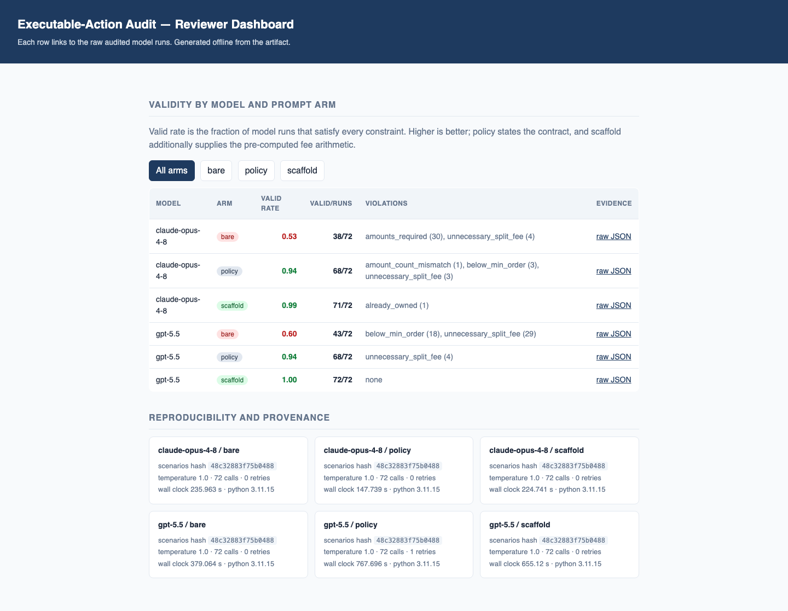

# ActionAudit Reproducibility Artifact

This is a reviewer artifact for auditing AI investment recommendations against
a deterministic, replayable portfolio baseline. The artifact does not try to
prove a new stock-picking alpha. It asks a narrower question first:
before a recommendation earns any return statistic, is it executable, stable
across repeated runs, grounded in the frozen scenario, and consistent with the
portfolio's fee and concentration constraints?

The dashboard is optional, but it shows the same contract the paper studies:
tracked input source, deterministic reviewer mode, proposed orders, guardrails,
and a decision log. Orders are proposed only; no trade is placed.

## Reviewer? Start here

```bash
make review     # ~1 min: re-derives the paper's headline numbers from frozen data and prints PASS for each
```

No API keys are needed for the reported results, and `make review` itself does
not contact the network: the frozen model runs ship with the artifact. Full host
reproduction installs Python and frontend dependencies unless they are already
available locally. See **[REVIEWER_GUIDE.md](REVIEWER_GUIDE.md)** for the
paper-to-artifact map and the full reproduction.



The dashboard (`paper/data/review_dashboard.html`) opens in any browser and
shows the headline result: validity by model and prompt arm, the violations
behind each failure, and the provenance hashes.

## Reviewer Path

Use Docker for the shortest science-only check:

```bash
make repro-docker
```

Use the host path when you want the Python tests, frontend checks, regenerated
figures, cached advisor audit, and data hashes:

```bash
make setup
make verify-data
make privacy-audit
make verify
make price-backtest-reference
make experiments
make ai-advisor-audit
make advisor-run-audit
make figure-audit
```

`make all` runs the same host reproduction sequence. This artifact contains the
experiments that support the paper, not the manuscript itself: the written paper
is submitted separately to the venue and is only referenced here by its anonymous
URL. The empirical PDF files under `paper/figures/` are regenerated by the
experiment commands, and `paper/data/` holds the frozen inputs. The conceptual
TikZ mechanism diagram is source, not generated output.

## What To Check

| Claim surface | Command or file | Expected evidence |
| --- | --- | --- |
| Headline frontier result | `make review` | Re-derives bare/policy/scaffold validity for GPT-5.5 and Opus-4.8 and prints PASS against the paper |
| Data snapshot integrity | `make verify-data` | SHA-256 hashes match `paper/data/DATA_HASHES.txt` |
| Privacy/anonymity gate | `make privacy-audit` | Fails on high-confidence author paths, private fixture sentinels, emails, and secret tokens |
| Implementation safety | `make verify` | Ruff, pytest, frontend build, and ESLint pass |
| Offline backtest reference | `make price-backtest-reference` | Regenerates `paper/data/price_backtest_reference.json` from the tracked return matrix |
| Fee and guardrail figures | `make experiments` | Regenerates vector figures and an experiment JSON |
| Advisor audit benchmark | `make ai-advisor-audit` | Regenerates the offline audit figure and summary |
| Cached model pilot | `make advisor-run-audit` | Re-evaluates tracked model outputs without API calls |
| Figure vector quality | `make figure-audit` | Confirms generated figures contain no raster images and embed fonts |

## Dashboard Smoke Test

The dashboard can run from the tracked fixture with a temporary database, so it
does not depend on local broker exports or prior decision logs:

```bash
rm -f tmp/reviewer-dashboard.db
ACTIONAUDIT_PORTFOLIO_INBOX="$PWD/tests/fixtures" \
ACTIONAUDIT_DATABASE_PATH="$PWD/tmp/reviewer-dashboard.db" \
bash run.sh
```

Open:

```text
http://127.0.0.1:5173/?offline_demo=true&cash=1500.00
```

Then click `Analyze`. The expected path is visible in the screenshot above:
reviewer mode uses synthetic replay fundamentals, reads
`tests/fixtures/seed_portfolio_broker.csv`, proposes orders, records a decision,
and displays the guardrails that excluded overweight positions.

## Frozen Inputs

The reproducible results use only tracked inputs:

- `tests/fixtures/seed_portfolio_broker.csv` - synthetic reviewer-safe
  portfolio fixture, not a private brokerage export.
- `paper/data/returns_matrix.csv` - frozen adjusted-return matrix for the
  current-basket study.
- `paper/data/price_backtest_reference.json` - tracked backtest reference used
  when live price exports are absent.
- `paper/data/ai_advisor_scenarios.json` - 120 frozen advisor-audit scenarios;
  `paper/data/adversarial_scenarios.json` - the 24 adversarial scenarios.
- `paper/data/adversarial_runs/{openai,anthropic}/.../{bare,policy,scaffold}/` -
  frozen frontier-model runs for the headline adversarial sweep, each with the
  prompt, hash, raw response, parsed output, usage, finish reason, and a
  truncation flag. `make review` re-derives the paper's numbers from these.
- `paper/data/advisor_runs/*/*/*.json` - cached three-scenario pilot outputs,
  prompts, hashes, usage metadata, and parsed responses.

No API key is required for the reported results. Live advisor collection is
opt-in and budget-capped:

```bash
python scripts/collect_advisor_runs.py --provider azure --model chat --runs 3 --live --max-calls 10
```

Estimate a planned live run without spending money:

```bash
make advisor-budget
```

New experiments should stay isolated until promoted deliberately. `make
price-backtest` fetches fresh free adjusted closes and writes ignored reports
under `exports/`; it does not alter the paper's frozen reference. Paid-provider
advisor runs require `--live`, provider credentials, and an explicit call budget.
After any promoted data change, rerun `python scripts/hash_data.py --write`,
`make verify-data`, and `make privacy-audit`.

## Key Insight

Agreement is not validity. A model can match the baseline tickers while
splitting sub-tranche cash into fee-worsening orders, citing unsupported facts,
or overspending cash. ActionAudit separates three axes that a single return or
overlap score conflates:

- `validity`: every recommendation satisfies deterministic constraints;
- `stability`: repeated runs remain consistent, including amount-aware sizing;
- `agreement`: the output overlaps with the deterministic baseline.

The fee math is intentionally small. The broker fee is a started-tranche step
function, splitting cannot reduce that fee, and the economic order floor is
`fee / tolerance`. Everything else is measured by executable code and exact
tests.

## Scope

This artifact is anonymous and venue-neutral. It intentionally excludes private
portfolio exports, local `.env` files, downloaded bibliography PDFs, generated
reports under `exports/`, and the compiled submission PDF. The backtest is a
current-basket price-history calibration, not a point-in-time stock-selection
test. The cost model covers fixed per-order tranche fees; spreads, taxes,
slippage, liquidity, and integer-lot rules are documented as extension
predicates rather than silently modeled.
